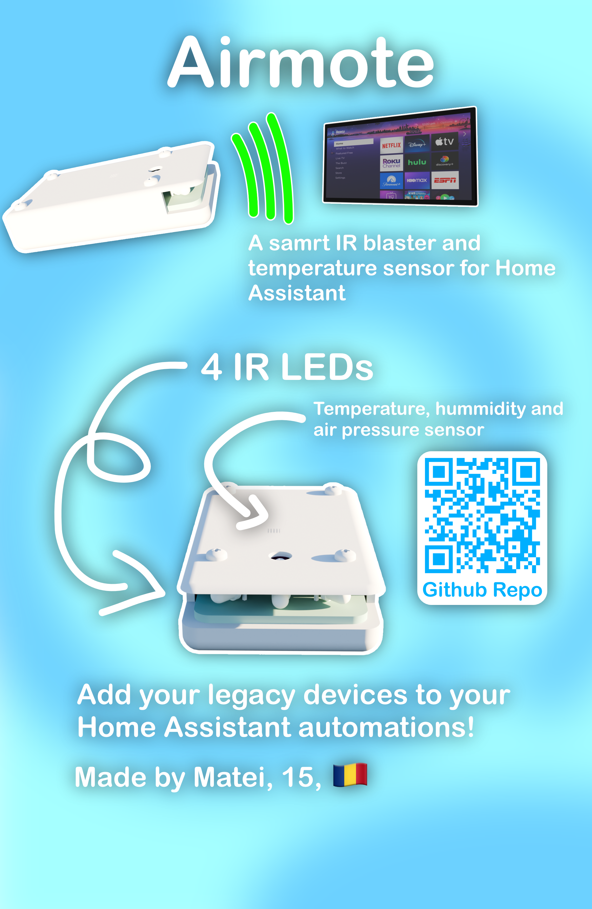
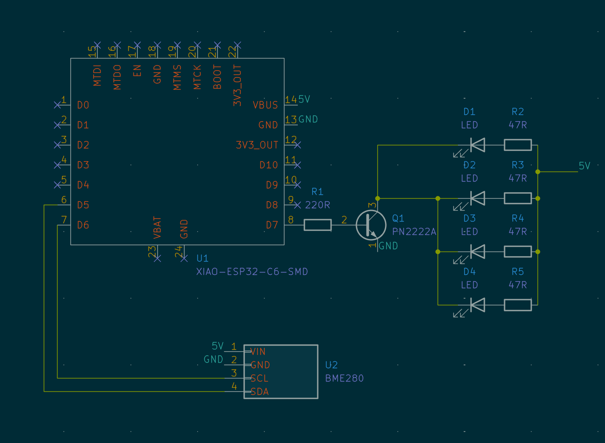
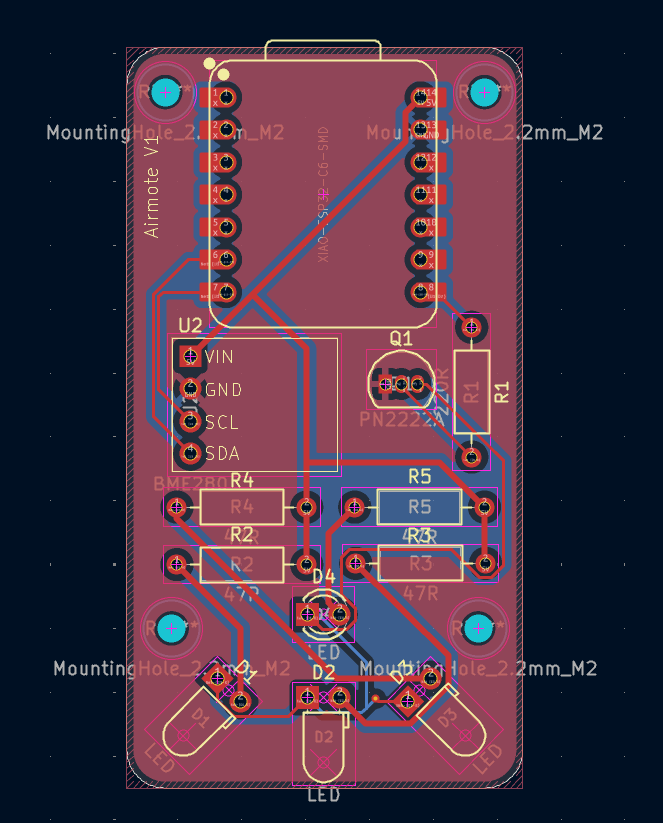
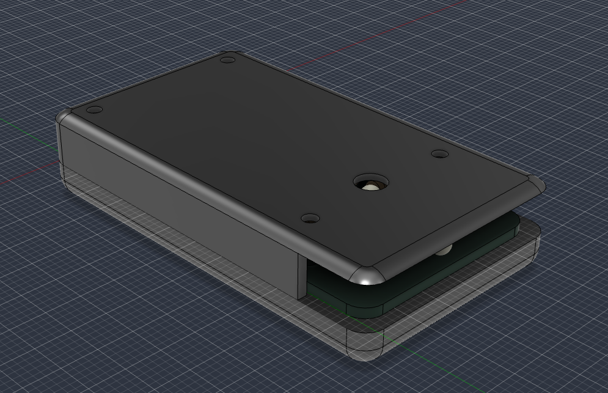
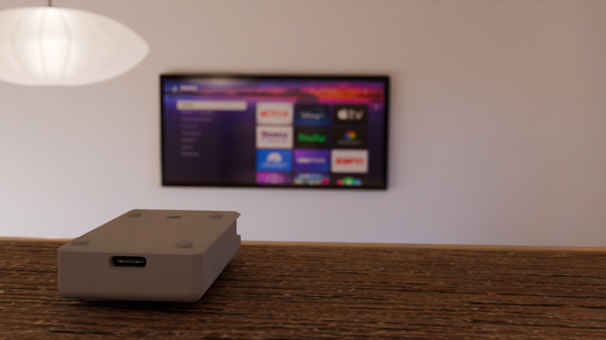

# Airmote

  

Control any IR device and monitor room temperature, pressure and humidity with Home Assistant.

# Zine

# Why?

  

I always wanted to add my older devices that aren't compatible with Home Assistant to my automations. I want to turn my old stereo on when I start playing music, without having to reach for the half-broken remote.

# Firmware

For the firmware, use [ESPHome](https://esphome.io)

[Install guide](https://esphome.io/guides/getting_started_hassio/)

# Schematic and PCB

  

The schematic and PCB are pretty simple, just connecting the LEDs to a 2n2222 transistor and accompanying resistors for protection.

  

  

  

# Case

  

I went for a industrial design as this device is intended to be hidden away on a high surface, away from sight. The bottom and top of the case are held by m2 screws along side bolts and heat inserts.

Designed in Fusion 360.
Files are available in 3D/Airmote.f3z

  

  

  

# BOM

  

|Item|Count|Price|Link|
|--|--|--|--|
|Seeed Studio XIAO ESP32-C6|1|$5.20|[Seeed Studio](https://www.seeedstudio.com/Seeed-Studio-XIAO-ESP32C6-p-5884.html)|
|**3mm 940nm IR LED***|4|$1.47/lot|[Aliexpress](https://www.aliexpress.com/item/1005002345587711.html)|
|**2N2222 transistor***|1|$3.75/lot|[Aliexpress](https://www.aliexpress.com/item/1005010396511377.html)  (Select 2n2222 in the listing)|
|**220 Ohm resistor***|1|$0.63/lot|[Aliexpress](https://www.aliexpress.com/item/1005002489867848.html) (Select 220R in the listing)|
|**47 Ohm resistor***|4|$0.63/lot|[Aliexpress](https://www.aliexpress.com/item/1005002489867848.html) (Select 47R in the listing)|
|BME280 sensor breakout board|1|$4.00|[Aliexpress](https://www.aliexpress.com/item/1005012601108975.html) (Select 5V or else it won't fit)|
|**Heat brass inserts***|4|$7.09/lot|[Aliexpress](https://www.aliexpress.com/item/1005006798286851.html) (Select M2(OD3mm) and 2mm length)|
|**M2 Screws***|4|$3.85/lot|[Aliexpress](https://www.aliexpress.com/item/4000038065691.html) (Select M2 10mm in the listing)|
|Shipping|-|$63.05|-|
|**Total**|-|$89.81|-|

***ONLY** buy the listing of **bolded** items ONCE. Those are sold as a lot and you will be getting 50/100pcs per listing bought.

# Credits

[Hackclub Fallout](https://fallout.hackclub.com) - Founding

[Kicad](https://kicad.org) - Schematic and PCB design

[ESPHome](https://esphome.io) - Firmware
